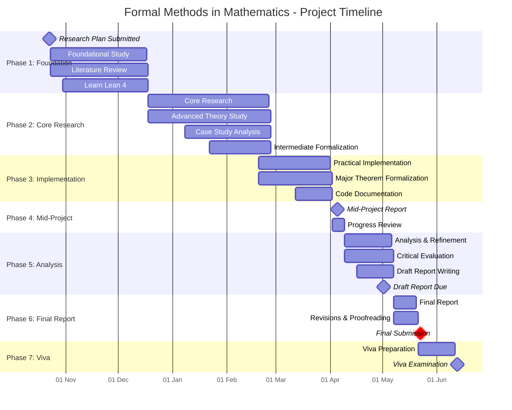

# Research Plan: Formal Methods in Mathematics

> **Student Name**: William Fayers
> **Module**: MTH3011

## 1. Project Title

**Formal Methods in Mathematics**: An Investigation into Proof Assistants and Formal Mathematical Reasoning

## 2. Project Description and Introduction

Mathematical proof embodies absolute truth, yet depends on fallible human reasoning.

The Needham-Schroeder protocol (1978) was widely accepted as secure based only on design rationale and informal peer review, remaining unchallenged for 17 years until Gavin Lowe published the first attack in 1995 using formal computer-aided analysis.

The 255-page Feit-Thompson theorem (1963) had verification attempts, but no individual could fully verify the proof - underpinning theorems like the classification of finite simple groups -, until the Microsoft Research-Inria Joint Centre completed computer-assisted verification in 2012.

When proof complexity outgrows the capacity 
grows, review capacity often falls behind.

## 3. Connection to Previous Studies

The project builds upon several areas of academic and practical experience:

- **Proof and Logic (Ideas of Proof, Algebra, Algebraic Structures)**: These modules taught me rigorous proof techniques and fostered an understanding of mathematical reasoning essential for engaging with formal proofs.
- **Computation and Technical Application (Scientific Computing, Computer Algebra and Technical Computing, Numerical Methods)**: Practice using algorithmic approaches and computation enables me to work effectively with proof assistants and work in a computational environment.
- **Abstract Structures and Advanced Topics (Linear Algebra, Differential Equations, Complex Analysis, Coding Theory, Industrial and Financial Mathematics)**: Increased my structural reasoning and knowledge of fields where formal methods see real-world use, e.g. cryptography.
- **Programming Expertise**: Extensive experience in Python in real-world environments alongside comprehensive documentation, as well as experience in a variety of other modern software following best development practices.

## 4. Literature Survey

1. …

## 5. References (IEEE)

1. M. Ayala-Rincon and F. L. C. de Moura, *Applied Logic for Computer Scientists: Computational Deduction and Formal Proofs*, Springer, 2017.
2. H. Geuvers, "Proof assistants: history, ideas and future," *Sadhana*, vol. 34, pp. 3–25, 2009.
3. L. C. Paulson, "A machine-assisted proof of Gödel's incompleteness theorems for the theory of hereditarily finite sets," *Review of Symbolic Logic*, vol. 7, no. 3, pp. 484–498, 2014.
4. E. Mendelson, *Introduction to Mathematical Logic*, 6th ed., CRC Press, 2015.
5. …

## 6. Equipment, Facilities, and Software Requirements

### Software and Computational Resources

- **Primary Tools**:
	- **Lean 4** with `mathlib` library (primary proof assistant),
	- **Coq** with standard library (secondary/comparative study),
	- **VS Code** with Lean/Coq extensions (development environment),
	- **Git/GitHub** for version control of formalised code.
- **Development Environment**:
	- Personal laptop (sufficient for proof assistant work),
	- No specialised hardware required.
- **Documentation and Writing**:
	- **LaTeX** local installation for report preparation.
	- **Obsidian/Markdown** for research notes and logbook.

***All required software is freely available** as open-source tools, requiring no financial expenditure.*

### Facilities

**Primary workspace**: University of Lincoln, Isaac Newton Building, INB2304 (quiet study, computer access).
**Secondary workspace**: University of Lincoln, University Library (quiet study, library access).
**Meeting Space**: University of Lincoln, Isaac Newton Building, INB3311 (supervisor's office).

***No special laboratory requirements** as project is predominantly theoretical/computational.*

## 7. Consumables and Costs

**Consumables**: £0 (no physical materials required).
**Software**: £0 (all tools are free and open-source).
**Equipment**: £0 (using existing personal/university computers).
**Total Project Cost**: £0

***The project is minimal-cost**, relying on existing resources and freely available software.*

## 8. Action Plan and Timeline

The project spans approximately 30 weeks from 23 October 2025 to the final deadline of 22 May 2026, employing a mixed theoretical-practical methodology as seen below:

1. **Foundational Study (Weeks 1-8)**: Background reading and software familiarisation.
2. **Core Research (Weeks 9-18)**: …
3. **Practical Implementation (Weeks 18-23)**: …
4. **Mid-Project Report (Week 24)**: …
5. **Analysis & Refinement (Weeks 25-28)**: …
6. **Final Report (Weeks 29-30)**: …

## 9. Ethical Considerations

This project has been reviewed according to University of Lincoln ethical guidelines. The research involves:

- No human participants or subjects,
- No animal subjects,
- No collection of personal data,
- No sensitive or confidential data,
- No potential for physical, psychological, or social harm.

Should the scope expand to include any of the above then appropriate ethics approval will be sought via the College ethics committee before proceeding.

## 10. Risk Assessment

Given the theoretical and computational nature of the project, health and safety risks posed are minimal and comparable to everyday office/study activities. However, the following considerations apply:

|         Task          |                Hazard                |      Who's Affected       |     Probability      | Severity  | Initial Risk |
| :-------------------: | :----------------------------------: | :-----------------------: | :------------------: | :-------: | :----------: |
| Extended computer use | Eye strain, repetitive strain injury |          Student          |     3 (Probable)     | 2 (Minor) |  6 (Medium)  |
|     Computer use      |          Electrical hazard           | Student and others nearby | 1 (Extremely remote) | 4 (Major) |   4 (Low)    |
|   Prolonged sitting   |      Musculoskeletal discomfort      |          Student          |     2 (Possible)     | 2 (Minor) |   4 (Low)    |
|    Mental workload    |      Stress, cognitive fatigue       |          Student          |     2 (Possible)     | 2 (Minor) |   4 (Low)    |

Given these risks, the project will take the following control measures to mitigate risk to the following residual considerations:

|         Task          |                                                           Control Measures                                                            |     Probability      | Severity  | Residual Risk |
| :-------------------: | :-----------------------------------------------------------------------------------------------------------------------------------: | :------------------: | :-------: | :-----------: |
| Extended computer use | Take 20-minute breaks every hour; follow Display Screen Equipment (DSE) guidelines; maintain proper posture; adjust screen brightness | 1 (Extremely remote) | 2 (Minor) |    2 (Low)    |
|     Computer use      |                               PAT-tested equipment; no liquids near equipment; proper cable management                                | 1 (Extremely remote) | 4 (Major) |    4 (Low)    |
|   Prolonged sitting   |                                             Regular breaks; stretching; ergonomic seating                                             | 1 (Extremely remote) | 2 (Minor) |    2 (Low)    |
|    Mental workload    |                           Structured work schedule; regular supervisor meetings; maintain work-life balance                           | 1 (Extremely remote) | 2 (Minor) |    2 (Low)    |

**Overall Risk Assessment**: Low (all residual risks ≤ 4), so no specialised risk assessment required as confirmed with supervisor. The assessment will be reviewed if project scope changes to include any physical experiments or equipment testing that isn't currently anticipated.

## 11. Arrangements for Regular Supervisory Discussions

The following arrangements have been established for supervisory meetings:

> **Supervisor**: Dr. Yuri Santos Rego
> **Email**: <YSantosRego@lincoln.ac.uk>

### Meeting Schedule

- **Frequency**: Every week.
- **Duration**: Approximately 30 minutes per meeting.
- **Location**: Supervisor's office.

**Back-up Arrangements** will be decided on an ad-hoc basis after email contact.

### Meeting Structure

1. Review of logbook entries since previous meeting,
2. Discussion of progress on current phase objectives,
3. Technical questions and problem-solving,
4. Feedback on written work or formal developments,
5. Agreement on goals for next meeting period,
6. Supervisor signature and date in logbook.
