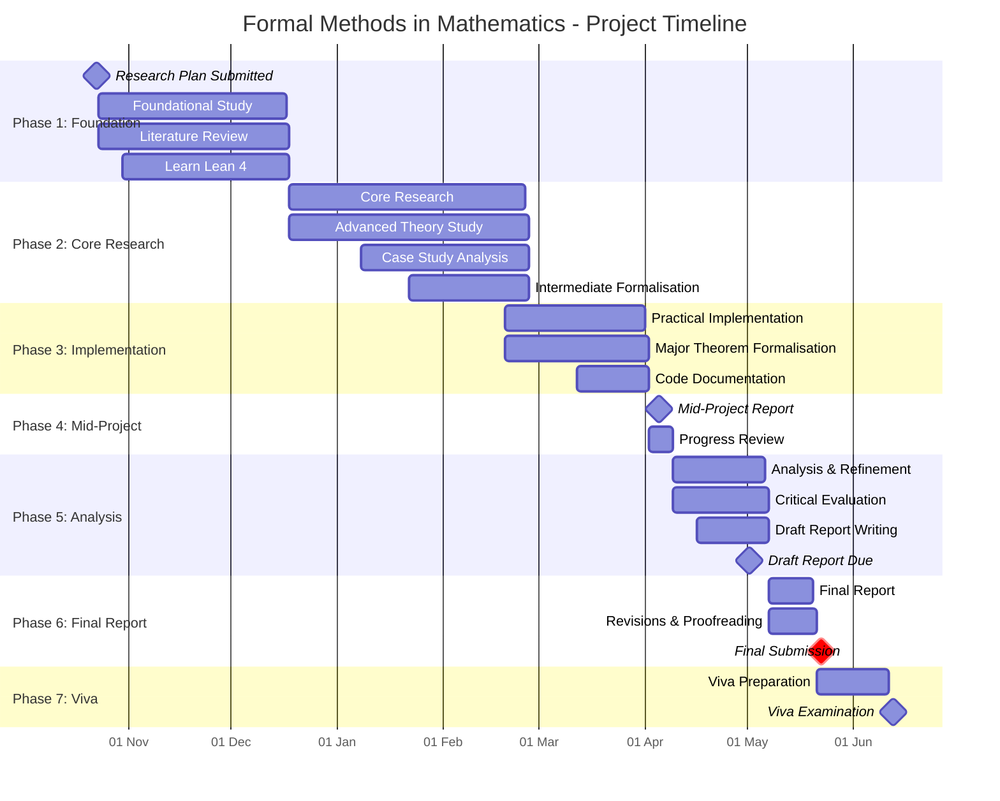

# Research Plan: Formal Methods in Mathematics

> **Student Name**: William Fayers
> **Module**: MTH3011
> **Supervisor**: Dr. Yuri Santos Rego
> **Email**: <YSantosRego@lincoln.ac.uk>

## 1. Project Title

**Formal Methods in Mathematics**: An Investigation into Proof Assistants and Formal Mathematical Reasoning

## 2. Project Description and Introduction

Mathematical proofs claim absolute truth yet depend on fallible human reasoning \[1\]. The Needham-Schroeder protocol (1978) was accepted as secure on design rationale and informal peer review, unchallenged for 17 years until Gavin Lowe's 1995 attack derived from formal computer-aided analysis \[11\]. The 255-page Feit-Thompson theorem (1963), which underpins the classification of finite simple groups \[7\], had no complete individual verification until a Microsoft Research-Inria team completed computer-assisted verification in 2012 \[7\]. When proof complexity outruns review capacity, errors hide. In safety-critical systems - aerospace, cryptography, medical devices - those errors can be fatal.

Formal methods answer this by mechanically verifying logic with proof assistants such as Lean \[5\], Coq \[6\], and PVS. These rest on type theory \[9\] and higher-order logic \[4\], displacing intuition with rule-by-rule kernel checking. Mistakes in critical systems have promoted formal methods from academic rigour to industrial necessity. The Intel Pentium division bug cost $475 million; Amazon Web Services requires formal verification for core infrastructure; NASA certifies flight systems with PVS. Each tool decomposes logic to its simplest form: true or false.

At the scale of Feit-Thompson \[7\], no single reviewer can audit every nuance. As research and engineering grow more complex, peer review cannot catch every subtlety - which is why proof assistants have gained such weight \[2\].

As a programmer in high-stakes industries, I have tested everything I designed and still missed edge cases. As a mathematics student, I have spent hours on a problem only for a colleague to spot an error near the start. The intersection of logic, computation, and mathematics is attractive because it promises something rare: certainty. Formal methods enforce a precision informal work cannot.

This project brings those fields together. I will build theoretical foundations in logic, type theory, and the limits Gödel's incompleteness theorems impose \[3\]\[4\]. I will formalise mathematical theorems hands-on in Lean or Coq \[5\]\[6\], probing why so many industries reach for proof assistants \[12\]. I will examine the real-world applications and weigh where the formality earns its keep against where it merely adds overhead. The outcome is rigour and honest assessment: where do formal methods actually matter?

## 3. Connection to Previous Studies

The project builds on several areas of academic and practical experience:

- **Proof and Logic (Ideas of Proof, Algebra, Algebraic Structures)**: These modules taught rigorous proof technique and the mathematical reasoning needed to engage with formal proofs.
- **Computation and Technical Application (Scientific Computing, Computer Algebra and Technical Computing, Numerical Methods)**: Practice with algorithmic approaches and computation supports working effectively in a proof-assistant environment.
- **Abstract Structures and Advanced Topics (Linear Algebra, Differential Equations, Complex Analysis, Coding Theory, Industrial and Financial Mathematics)**: Built up the structural reasoning and exposure to fields where formal methods see real-world use, e.g. cryptography \[12\].
- **Programming Expertise**: Several years of Python in production settings, with documentation discipline and exposure to a range of modern software stacks.

## 4. Literature Survey

| Year | Author(s)                                                                                                                                                                                 | Publication Name                                                                                                                                                 | Content Summary                                                                                                                                                                                                                      | Relation to Project                                                                                                                                                                                                                         |
| ---- | ----------------------------------------------------------------------------------------------------------------------------------------------------------------------------------------- | ---------------------------------------------------------------------------------------------------------------------------------------------------------------- | ------------------------------------------------------------------------------------------------------------------------------------------------------------------------------------------------------------------------------------ | ------------------------------------------------------------------------------------------------------------------------------------------------------------------------------------------------------------------------------------------- |
| 2017 | Ayala-Rincón, M. & de Moura, F.L.C.                                                                                                                                                       | Applied Logic for Computer Scientists: Computational Deduction and Formal Proofs                                                                                 | Comprehensive textbook covering propositional logic, first-order logic, formal proof systems, recursive functions, and type theory foundations specific to computational applications.                                               | Provides foundational knowledge in computational logic and derivation techniques essential for understanding proof assistants like Lean and Coq.                                                                                            |
| 2009 | Geuvers, H.                                                                                                                                                                               | Proof Assistants: History, Ideas and Future, *Sadhana*, vol. 34, pp. 3–25                                                                                        | Surveys historical development of proof assistants from Automath through LCF, HOL, Coq, and Isabelle; discusses type theory foundations, Curry-Howard correspondence, and evolution of proof assistant architecture.                 | Provides essential historical context and theoretical understanding of how modern proof assistants evolved, particularly type theory and development of different proof approaches.                                                         |
| 2014 | Paulson, L.C.                                                                                                                                                                             | A Machine-Assisted Proof of Gödel's Incompleteness Theorems for Hereditarily Finite Sets, *Review of Symbolic Logic*, vol. 7, no. 3, pp. 484–498                 | First complete formal verification of Gödel's second incompleteness theorem using Isabelle/HOL, demonstrating use of hereditarily finite sets and revealing subtleties in traditional proofs.                                        | Exemplifies power of formal methods in catching proof errors and demonstrating where machine verification adds rigorous value; demonstrates technical challenges in formalising complex mathematical theorems.                              |
| 2015 | Mendelson, E.                                                                                                                                                                             | Introduction to Mathematical Logic, 6th ed., CRC Press                                                                                                           | Comprehensive textbook covering propositional calculus, quantification theory, formal number theory, set theory axioms, and effective computability with detailed treatment of Gödel's incompleteness theorems.                      | Supplies rigorous theoretical foundations in mathematical logic, proof theory, and computability essential for understanding formal systems implemented in proof assistants.                                                                |
| 2015 | de Moura, L., Kong, S., Avigad, J., van Doorn, F., & von Raumer, J.                                                                                                                       | The Lean Theorem Prover (System Description), *25th International Conference on Automated Deduction (CADE-25)*                                                   | System description of Lean's design with focus on small trusted kernel based on dependent type theory, elaboration procedures, universe polymorphism, and integration of automation tactics.                                         | Primary reference for understanding Lean architecture, design philosophy, and technical implementation; essential for hands-on formalisation work in Lean 4.                                                                                |
| 2004 | Bertot, Y. & Castéran, P.                                                                                                                                                                 | Interactive Theorem Proving and Program Development: Coq'Art – The Calculus of Inductive Constructions, Springer                                                 | Pragmatic introduction to Coq covering calculus of inductive constructions, proof tactics, program extraction, and numerous practical examples of mathematical theory development.                                                   | Provides comprehensive practical guidance for Coq formalisation; essential reference for secondary proof assistant study and comparison with Lean.                                                                                          |
| 2012 | Gonthier, G., Asperti, A., Avigad, J., Bertot, Y., Cohen, C., Garillot, F., Le Roux, S., Mahboubi, A., O'Connor, R., Pal, S., Pasca, I., Rideau, L., Solovyev, A., Tassi, E., & Théry, L. | A Machine-Checked Proof of the Odd Order Theorem, *Interactive Theorem Proving (ITP 2013)*, LNCS 7998                                                            | Six-year formal verification of the Feit-Thompson theorem in Coq (255-page proof formalised as ~150,000 lines of code with 4,000 definitions and 13,000 lemmas); demonstrates feasibility of formalising complex modern mathematics. | Landmark case study of formal methods applied to major mathematical result; demonstrates both capabilities and effort required for large-scale mathematical formalisation; directly supports project's examination of formal methods value. |
| 2012 | Gonthier, G.                                                                                                                                                                              | A Computer-Checked Proof of the Four Colour Theorem, in *Handbook of the History of Logic, Vol. 9: Computational Logic*                                          | First complete formal proof of the Four Colour Theorem in Coq (60,000+ lines of proof code); demonstrates formalisation of theorem combining mathematical reasoning with computer-verified case analysis.                            | Major case study showing application of formal methods to previously computer-dependent proof; illustrates intersection of mathematics, computation, and verification relevant to project objectives.                                       |
| 2023 | Nederpelt, R.P. & Geuvers, H.                                                                                                                                                             | Type Theory and Formal Proof: An Introduction, 2nd ed., Cambridge University Press                                                                               | Advanced textbook building from lambda calculus through simply-typed and dependent type systems to calculus of constructions; includes elaborated examples of formalising mathematical proofs.                                       | Comprehensive treatment of type theory foundations underlying modern proof assistants; provides theoretical depth for understanding proof assistant design and formal mathematics.                                                          |
| 2024 | Tao, T., Gowers, T., Green, B., & Manners, F.                                                                                                                                             | Marton's Polynomial Freiman-Ruzsa Conjecture, preprint; formalised in Lean 4                                                                                     | Recent breakthrough proof of PFR conjecture with complete Lean formalisation (3 weeks from paper publication); demonstrates rapid collaborative formalisation and integration of AI-assisted proof discovery in modern mathematics.  | State-of-the-art example of formal methods adoption in cutting-edge mathematics; shows practical integration of Lean in active mathematical research and AI applications; exemplifies real value of formal verification.                    |
| 1995 | Lowe, G.                                                                                                                                                                                  | Breaking and Fixing the Needham-Schroeder Public-Key Protocol using CSP and FDR, *Tools and Algorithms for the Construction and Analysis of Systems (TACAS '96)* | Formal discovery of previously unknown man-in-the-middle attack on widely-accepted Needham-Schroeder protocol using formal methods; demonstrates necessity of rigorous verification in cryptographic protocols.                      | Historical case study illustrating critical failure of informal peer review and essential role of formal methods in security-critical systems; motivates formal verification methodology.                                                   |
| 2011 | Smyth, B.                                                                                                                                                                                 | Formal Verification of Cryptographic Protocols (PhD Thesis), University of Birmingham                                                                            | Comprehensive treatment of formal verification techniques for cryptographic protocols with emphasis on automation and symbolic analysis; discusses Dolev-Yao model and protocol verification methodologies.                          | Demonstrates industrial applications of formal methods in cryptography; provides concrete examples of where formal verification provides essential security guarantees relevant to project's critical systems analysis.                     |

## 5. References (IEEE)

\[1\] M. Ayala-Rincon and F. L. C. de Moura, *Applied Logic for Computer Scientists: Computational Deduction and Formal Proofs*, Springer, 2017.

\[2\] H. Geuvers, "Proof assistants: history, ideas and future," *Sadhana*, vol. 34, pp. 3–25, 2009.

\[3\] L. C. Paulson, "A machine-assisted proof of Gödel's incompleteness theorems for the theory of hereditarily finite sets," *Review of Symbolic Logic*, vol. 7, no. 3, pp. 484–498, 2014.

\[4\] E. Mendelson, *Introduction to Mathematical Logic*, 6th ed., CRC Press, 2015.

\[5\] L. de Moura, S. Kong, J. Avigad, F. van Doorn, and J. von Raumer, "The Lean theorem prover (system description)," in *25th International Conference on Automated Deduction (CADE-25)*, Berlin, Germany, 2015.

\[6\] Y. Bertot and P. Castéran, *Interactive Theorem Proving and Program Development: Coq'Art – The Calculus of Inductive Constructions*, Springer, 2004.

\[7\] G. Gonthier, A. Asperti, J. Avigad, Y. Bertot, C. Cohen, F. Garillot, S. Le Roux, A. Mahboubi, R. O'Connor, S. Pal, I. Pasca, L. Rideau, A. Solovyev, E. Tassi, and L. Théry, "A machine-checked proof of the odd order theorem," in *Interactive Theorem Proving (ITP 2013)*, LNCS 7998, 2012.

\[8\] G. Gonthier, "A computer-checked proof of the four colour theorem," in *Handbook of the History of Logic, Vol. 9: Computational Logic*, Elsevier, 2012.

\[9\] R. P. Nederpelt and H. Geuvers, *Type Theory and Formal Proof: An Introduction*, 2nd ed., Cambridge University Press, 2023.

\[10\] T. Tao, T. Gowers, B. Green, and F. Manners, "Marton's Polynomial Freiman-Ruzsa conjecture," preprint, 2024. \[Online\]. Available: <https://teorth.github.io/pfr/>

\[11\] G. Lowe, "Breaking and fixing the Needham-Schroeder public-key protocol using CSP and FDR," in *Tools and Algorithms for the Construction and Analysis of Systems (TACAS '96)*, 1995.

\[12\] B. Smyth, "Formal verification of cryptographic protocols," Ph.D. dissertation, University of Birmingham, 2011.

## 6. Equipment, Facilities, and Software Requirements

### Software and Computational Resources

- **Primary Tools**:
	- **Lean 4** with `mathlib` library (primary proof assistant),
	- **Coq** with standard library (secondary/comparative study),
	- **VS Code** with Lean/Coq extensions (development environment),
	- **Git/GitHub** for version control of formalised code.
- **Development Environment**:
	- Personal laptop (sufficient for proof assistant work),
	- No specialised hardware required.
- **Documentation and Writing**:
	- **LaTeX** local installation for report preparation.
	- **Obsidian/Markdown** for research notes and logbook.

***All required software is freely available** as open-source tools, requiring no financial expenditure.*

### Facilities

**Primary workspace**: University of Lincoln, Isaac Newton Building, INB2304 (quiet study, computer access).

**Secondary workspace**: University of Lincoln, University Library (quiet study, library access).

**Meeting Space**: University of Lincoln, Isaac Newton Building, INB3311 (supervisor's office).

***No special laboratory requirements** as project is predominantly theoretical/computational.*

## 7. Consumables and Costs

**Consumables**: £0 (no physical materials required).

**Software**: £0 (all tools are free and open-source).

**Equipment**: £0 (using existing personal/university computers).

**Total Project Cost**: £0

***The project is minimal-cost**, relying on existing resources and freely available software.*

## 8. Action Plan and Timeline

The project spans approximately 30 weeks from 23 October 2025 to the final deadline of 22 May 2026, employing a mixed theoretical-practical methodology as seen below:

### Phase 1: Foundational Study (Weeks 1-8, 23 Oct – 17 Dec 2025)

- Complete foundational reading of core references \[1\], \[2\], \[4\], \[9\] to establish theoretical base in logic, type theory, and proof assistant history
- Install and configure Lean 4 with mathlib and Coq with VS Code development environment
- Complete initial Lean 4 tutorials (Mathematics in Lean, Theorem Proving in Lean)
- Study Curry-Howard correspondence and basic type theory concepts
- Weekly supervisor meetings to review progress and discuss theoretical concepts
- Logbook entries documenting reading progress and software setup challenges

### Phase 2: Core Research (Weeks 9-18, 18 Dec 2025 – 25 Feb 2026)

- Advanced study of proof assistant architecture and design \[5\], \[6\]; compare Lean and Coq approaches
- In-depth examination of case studies: Feit-Thompson formalisation \[7\], Four Colour Theorem \[8\], and Gödel incompleteness formalisation \[3\]
- Analyse Lean formalisation of Polynomial Freiman-Ruzsa conjecture \[10\] as state-of-the-art example
- Develop intermediate-level proficiency in both Lean and Coq through practical exercises
- Identify 2-3 mathematical theorems suitable for formalisation (from different mathematical domains)
- Critical analysis of formal verification applications in cryptography \[11\], \[12\] and industrial systems
- Produce detailed notes on strengths/weaknesses of each proof assistant
- Supervisor meetings to discuss case study findings and formalisation strategy

### Phase 3: Practical Implementation (Weeks 19-23, 26 Feb – 01 Apr 2026)

- Formalise selected mathematical theorems in Lean 4 as primary project deliverable
- Document formalisation process, including debugging and proof strategy decisions
- Develop secondary Coq formalisation for comparison and learning
- Create comprehensive code documentation with inline comments explaining proof structures
- Reflect on practical challenges encountered: where formal methods added value versus overhead
- Produce preliminary comparative analysis of formal methods effectiveness
- Code repository commits with clear documentation of progress
- Supervisor meetings to review formalisation quality and discuss emerging insights

### Phase 4: Mid-Project Report (Week 24, 02 – 08 Apr 2026)

- Progress review with supervisor; present formalisation and preliminary analysis
- Synthesise findings from phases 1-3 into coherent narrative
- Identify any gaps requiring additional focus before final report
- Revise project objectives based on discoveries and remaining time
- Supervisor feedback session and refinement of final report structure

### Phase 5: Analysis and Refinement (Weeks 25-28, 09 Apr – 06 May 2026)

- Critical evaluation: assess where formal methods provide genuine value versus where they add complexity
- Analyse cost-benefit of formalisation across different mathematical domains
- Compare theoretical foundations with practical implementation experience
- Synthesise case study insights (Feit-Thompson, Four Colour, PFR, Gödel) with own findings
- Write draft final report incorporating all phases, analysis, and conclusions
- Incorporate supervisor feedback on draft sections
- Logbook completion with final reflections on learning journey
- Draft report due: 01 May 2026

### Phase 6: Final Report Preparation (Weeks 29-30, 07 – 22 May 2026)

- Comprehensive revisions and proofreading of final report
- Refine figures, diagrams, and mathematical notation
- Final incorporation of all formalisation code snippets and case study references
- Submission of formal code repository with complete documentation
- Final supervisor review and approval
- Final submission: 22 May 2026

### Phase 7: Viva Preparation and Examination (21 May – 12 Jun 2026)

- Prepare presentation slides and viva materials
- Practice presentation explaining formalisation, key findings, and conclusions
- Prepare for questions on theoretical foundations and practical implementation
- Viva examination: 12 June 2026

### Key Milestones and Deliverables

- **Week 8**: Literature review complete, Lean/Coq environments functional
- **Week 18**: Case studies analysed, formalisation strategy finalised
- **Week 23**: Primary mathematical theorems formalised in Lean
- **Week 24**: Mid-project report and progress review
- **Week 28**: Draft final report completed
- **Week 30**: Final report and code repository submitted
- **Week 32**: Viva examination

## 9. Ethical Considerations

This project has been reviewed according to University of Lincoln ethical guidelines. The research involves:

- No human participants or subjects,
- No animal subjects,
- No collection of personal data,
- No sensitive or confidential data,
- No potential for physical, psychological, or social harm.

Should the scope expand to include any of the above then appropriate ethics approval will be sought via the College ethics committee before proceeding.

## 10. Risk Assessment

Given the theoretical and computational nature of the project, health and safety risks posed are minimal and comparable to everyday office/study activities. However, the following considerations apply:

|         Task          |                Hazard                |      Who's Affected       |     Probability      | Severity  | Initial Risk |
| :-------------------: | :----------------------------------: | :-----------------------: | :------------------: | :-------: | :----------: |
| Extended computer use | Eye strain, repetitive strain injury |          Student          |     3 (Probable)     | 2 (Minor) |  6 (Medium)  |
|     Computer use      |          Electrical hazard           | Student and others nearby | 1 (Extremely remote) | 4 (Major) |   4 (Low)    |
|   Prolonged sitting   |      Musculoskeletal discomfort      |          Student          |     2 (Possible)     | 2 (Minor) |   4 (Low)    |
|    Mental workload    |      Stress, cognitive fatigue       |          Student          |     2 (Possible)     | 2 (Minor) |   4 (Low)    |

Given these risks, the project will take the following control measures to mitigate risk to the following residual considerations:

|         Task          |                                                           Control Measures                                                            |     Probability      | Severity  | Residual Risk |
| :-------------------: | :-----------------------------------------------------------------------------------------------------------------------------------: | :------------------: | :-------: | :-----------: |
| Extended computer use | Take 20-minute breaks every hour; follow Display Screen Equipment (DSE) guidelines; maintain proper posture; adjust screen brightness | 1 (Extremely remote) | 2 (Minor) |    2 (Low)    |
|     Computer use      |                               PAT-tested equipment; no liquids near equipment; proper cable management                                | 1 (Extremely remote) | 4 (Major) |    4 (Low)    |
|   Prolonged sitting   |                                             Regular breaks; stretching; ergonomic seating                                             | 1 (Extremely remote) | 2 (Minor) |    2 (Low)    |
|    Mental workload    |                           Structured work schedule; regular supervisor meetings; maintain work-life balance                           | 1 (Extremely remote) | 2 (Minor) |    2 (Low)    |

**Overall Risk Assessment**: Low (all residual risks ≤ 4), so no specialised risk assessment required as confirmed with supervisor. The assessment will be reviewed if project scope changes to include any physical experiments or equipment testing that isn't currently anticipated.

## 11. Arrangements for Regular Supervisory Discussions

The following arrangements have been established for supervisory meetings:

> **Supervisor**: Dr. Yuri Santos Rego
> **Email**: <YSantosRego@lincoln.ac.uk>

### Meeting Schedule

- **Frequency**: Every week.
- **Duration**: Approximately 30 minutes per meeting.
- **Location**: Supervisor's office.

**Back-up Arrangements** will be decided on an ad-hoc basis after email contact.

### Meeting Structure

1. Review of logbook entries since previous meeting,
2. Discussion of progress on current phase objectives,
3. Technical questions and problem-solving,
4. Feedback on written work or formal developments,
5. Agreement on goals for next meeting period,
6. Supervisor signature and date in logbook.

## 12. Addendum - Scope Revision (2026-01 / 2026-03)

*Agreed with supervisor by email on 2026-01-14 and formally confirmed in a follow-up email on 2026-03-11. No in-person meetings have taken place in 2026; all supervision contact this year has been by email. The original §§1–11 above are preserved as-submitted on 2025-10-22; this addendum documents the mid-project scope change.*

### 12.1 Why the Revision

The foundational reading of Ayala-Rincón & de Moura \[1\] and Nederpelt & Geuvers \[9\] over Nov–Dec 2025 clarified that a minimal proof assistant is buildable inside a final-year-undergrad timeframe, provided the underlying logic is kept small. Building one and re-formalising chosen theorems inside it gives the project a distinctive *inside-the-kernel* angle - understanding proof assistants by having implemented one - that a pure formalisation project cannot.

### 12.2 Revised Scope

- **Primary deliverable remains** a practical formalisation, but the deliverable is now *the same theorem set proved in two tools*: industrial-strength Lean 4 and a purpose-built toy propositional-logic proof assistant.
- **Theorem count narrowed** from 2–3 to **2**, because each theorem is now proved twice.
- **Toy assistant constraint**: propositional-logic kernel only, unless a chosen theorem strictly demands more. Implementation language chosen in April 2026 - Python 3, on the grounds that author familiarity outweighs the static-typing advantages of an unfamiliar ML-family language under tight time pressure.
- **Thesis centrepiece shifts** from "formalise mathematics in Lean" to "understand proof assistants by building one, and examine what that costs in expressivity versus what industrial tools afford."
- **Coq drops out** as a secondary formalisation target - its role is filled by the toy assistant and by a smaller comparative-ecosystem section in the report drawing on the literature.

### 12.3 Revised Action Plan

| Phase | Weeks | Dates | Focus |
|-------|-------|-------|-------|
| 1 | 1–8 | 2025-10-23 → 2025-12-17 | Foundational study (unchanged) |
| 2 | 9–14 | 2025-12-18 → 2026-01-28 | Case studies + pivot decision; proof-assistant internals reading |
| 3 | 15–20 | 2026-01-29 → 2026-03-11 | Lean formalisations of the two selected theorems |
| 4 | 21–25 | 2026-03-12 → 2026-04-15 | Toy proof assistant: design + core kernel |
| 5 | 26–28 | 2026-04-16 → 2026-05-06 | Re-formalise the two theorems in the toy; comparative analysis; draft report |
| 6 | 29–30 | 2026-05-07 → 2026-05-22 | Final report revisions; submission |
| 7 | - | 2026-05-21 → 2026-06-12 | Viva preparation and examination |

### 12.4 New Milestones

- **2026-04-22** - Two-theorem shortlist finalised (see [[formalisations]]).
- **2026-04-26** - First draft PDF to supervisor (end of Week 26, per email 2026-03-04).
- **2026-05-06** - All four formalisations complete (2 theorems × 2 tools).
- **2026-05-22** - Final submission.

### 12.5 Additional References Added Post-Submission

Two implementation-theory references added to support the toy-assistant work. Full details in [[report]] references:

- \[13\] B. C. Pierce, *Types and Programming Languages*, MIT Press, 2002.
- \[14\] R. Harper, *Practical Foundations for Programming Languages*, 2nd ed., Cambridge University Press, 2016.

### 12.6 What Is Unchanged

- §1 Project title, §3 connection to previous studies, §4 core literature survey entries, §5 IEEE references \[1\]–\[12\], §6 equipment / facilities / software, §7 costs, §9 ethics, §10 risk assessment, §11 supervisor arrangements all stand as-submitted.
- The primary question - *where do formal methods actually matter, versus where do they add overhead?* - is unchanged; the toy-assistant angle gives a sharper way to answer it.
